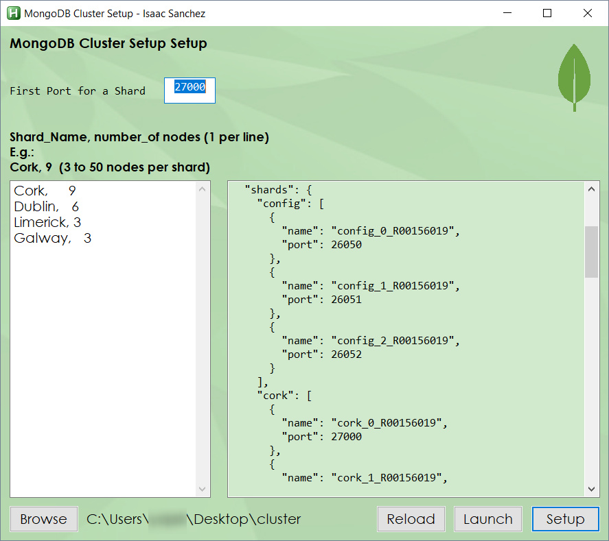
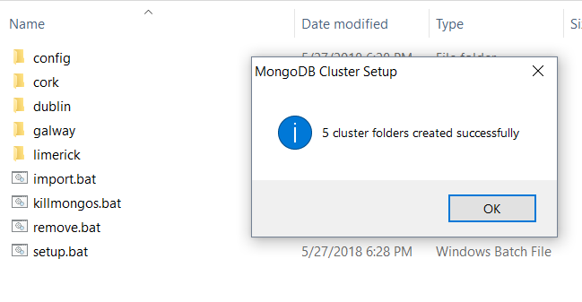
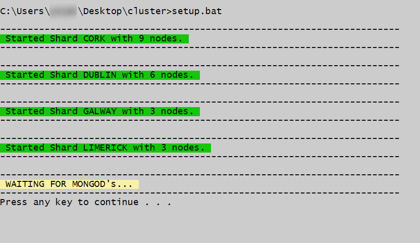
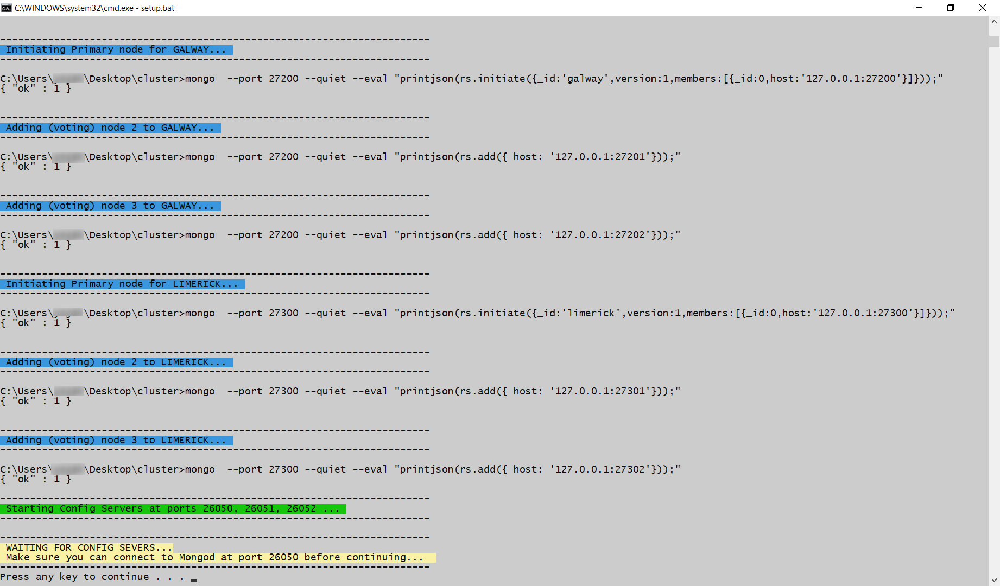
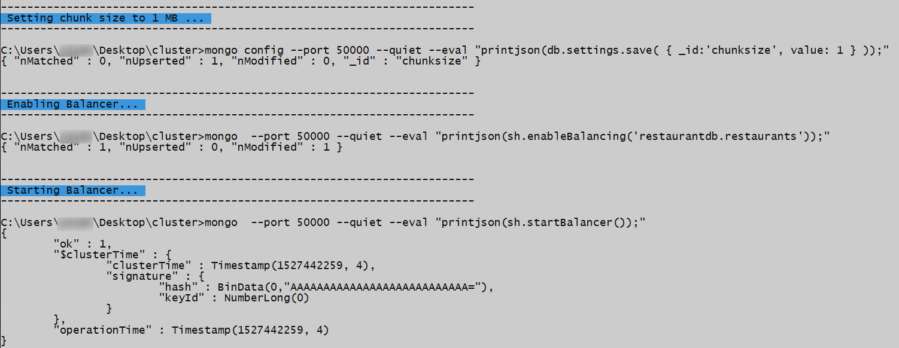
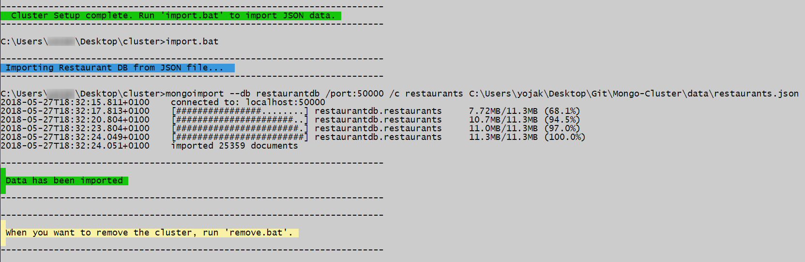

# MongoDB Sharded Cluster
### Setup batch files generated with Autohotkey
Simulation of several shards and nodes @ localhost
Configuration in data/vars.ahk

#### Some screenshots

---
&copy; Isaac Sanchez, 2018
